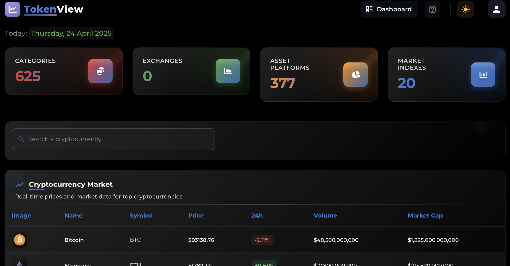
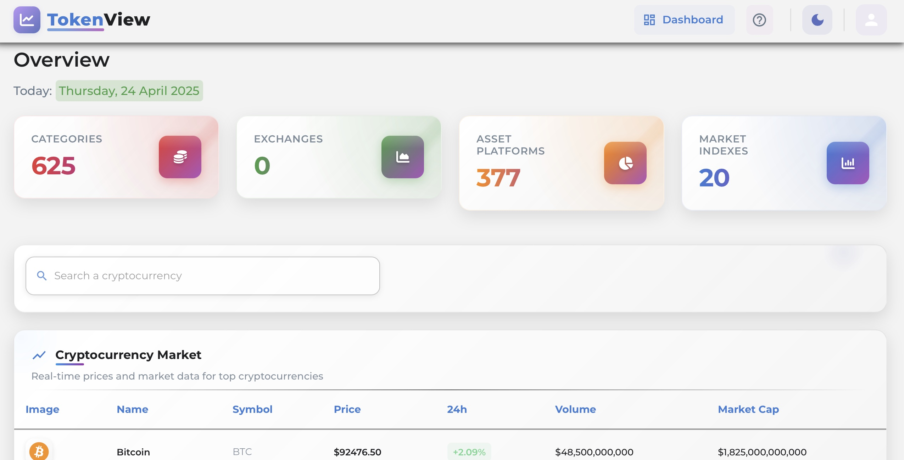

# TokenView Dashboard


## Description

TokenView Dashboard is a modern application for visualizing real-time cryptocurrency data. It features an intuitive interface and interactive charts to make crypto market tracking easy and efficient.

## Main Features

- **Real-time updates:** Cryptocurrency data refreshes every 30 seconds
- **Advanced visualizations:** 6 different chart types to analyze the market
- **Responsive design:** Works seamlessly on both desktop and mobile devices
- **Data redundancy:** Multiple data sources to ensure up-to-date information

## Screenshots

### Dark Mode



### Light Mode



## Quick Start

### Prerequisites

- Node.js (v14.0 or higher)
- npm (v6.0 or higher)

### Installation

1. Clone the repository:
   ```bash
   git clone https://github.com/rachell444/token-view.git
   cd token-view
   ```

2. Install dependencies:
   ```bash
   npm install
   ```

3. Iniciar la aplicación
```bash
npm start
```

4. Open http://localhost:3000 in your browser

## Project Structure

```
src/
├── components/      # Reusable components
│   ├── charts/       # Chart components (BarChart, PieChart, etc.)
│   ├── statistics/   # Statistics components
│   └── tables/       # Table components
├── layout/           # Layout components (Header, Sidebar, etc.)
├── pages/            # Main pages
├── theme/            # Theme configuration (colors, typography)
├── tests/            # Unit tests
└── index.js          # Entry point
```

## Customization

### Colors

To modify the colors, edit the file `src/theme/theme.js`.

### Typography

To change fonts, add the new font in `public/index.html` and modify `src/theme/typography.js`.

### Charts

Charts can be customized by editing the files in `src/components/charts/`.

## Testing

Run tests with the following command:

```bash
npm test
```

## Contribution

Contributions are welcome. For major changes, please open an issue first to discuss what you would like to change.

## License

This project is licensed under the MIT License – see the LICENSE file for details.

## Contact

Rachell Moron - [@rachell444](https://github.com/rachell444)

Project link: [https://github.com/rachell444/token-view](https://github.com/rachell444/token-view)
