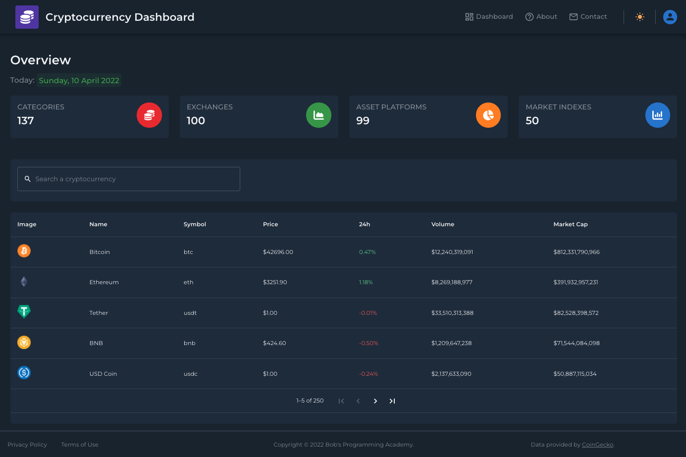
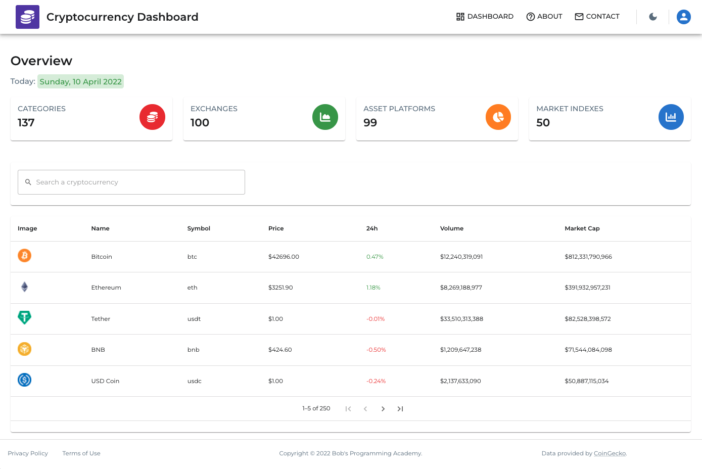

# TokenView Dashboard


## Descripción

TokenView Dashboard es una aplicación moderna para visualizar datos de criptomonedas en tiempo real. Está diseñada con una interfaz intuitiva y gráficos interactivos que facilitan el seguimiento del mercado cripto.

## Características Principales

- **Actualización en tiempo real**: Datos de criptomonedas actualizados cada 30 segundos
- **Visualizaciones avanzadas**: 6 tipos de gráficos diferentes para analizar el mercado
- **Diseño adaptable**: Interfaz responsiva que funciona en escritorio y dispositivos móviles
- **Sistema de respaldo**: Múltiples fuentes de datos para garantizar información actualizada
- **Modo oscuro/claro**: Soporta ambos temas para una mejor experiencia de usuario

## Tecnologías Utilizadas

- **Frontend**: React 18, Material UI 5
- **Visualización de datos**: Chart.js 4, react-chartjs-2
- **Gestión de datos**: Axios para solicitudes API
- **APIs**: CoinGecko (principal), CoinCap (respaldo)
- **Formato de datos**: Numeral.js para formatos monetarios

## Capturas de Pantalla

### Modo Oscuro



### Modo Claro



## Inicio Rápido

### Prerrequisitos

- Node.js (v14.0 o superior)
- npm (v6.0 o superior)

### Instalación

1. Clonar el repositorio
   ```bash
   git clone https://github.com/rachell444/token-view.git
   cd token-view
   ```

2. Instalar las dependencias
   ```bash
   npm install
   ```

3. Iniciar la aplicación
   ```bash
   npm start
   ```

4. Abrir http://localhost:3000 en tu navegador

## Estructura del Proyecto

```
src/
├── components/      # Componentes reutilizables
│   ├── charts/       # Componentes de gráficos (BarChart, PieChart, etc.)
│   ├── statistics/    # Componentes de estadísticas
│   └── tables/        # Componentes de tablas
├── layout/          # Componentes de estructura (Header, Sidebar, etc.)
├── pages/           # Páginas principales
├── theme/           # Configuración del tema (colores, tipografía)
├── tests/           # Pruebas unitarias
└── index.js         # Punto de entrada
```

## Personalización

### Colores

Para modificar los colores, edita el archivo `src/theme/theme.js`.

### Tipografía

Para cambiar las fuentes, añade la nueva fuente en `public/index.html` y modifica `src/theme/typography.js`.

### Gráficos

Los gráficos se pueden personalizar editando los archivos en `src/components/charts/`.

## Pruebas

Ejecuta las pruebas con el siguiente comando:

```bash
npm test
```

## Contribución

Las contribuciones son bienvenidas. Para cambios importantes, por favor abre primero un issue para discutir lo que te gustaría cambiar.

## Licencia

Este proyecto está licenciado bajo la Licencia MIT - consulta el archivo LICENSE para más detalles.

## Contacto

Rachel Moron - [@rachell444](https://github.com/rachell444)

Link del proyecto: [https://github.com/rachell444/token-view](https://github.com/rachell444/token-view)
